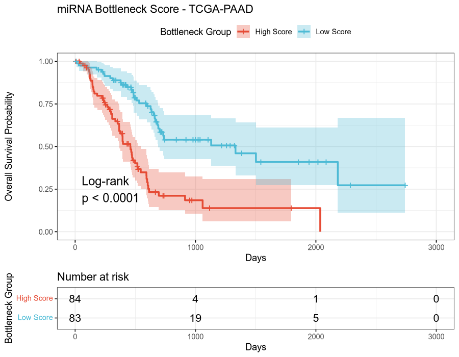

# mirBottleneck

> **miRNA Bottleneck Scoring for Pancreatic Cancer Survival Prediction**  
> Mark Barsoum Markarian · American University of Beirut · mb.markarian@aub.edu.lb

---

## Overview

`mirBottleneck` is an R package that identifies miRNAs acting as **transcriptome stabilizers** in pancreatic adenocarcinoma (TCGA-PAAD). It scores each miRNA along two complementary axes:

| Score | What it measures |
|---|---|
| **VSS** — Variance Suppression Score | How much a miRNA reduces expression variance across its validated targets |
| **Coherence Score** | How much a miRNA coordinates its targets into coherent co-expression programs |

miRNAs are then classified into four functional archetypes — **Silencer**, **Conductor**, **Dual**, and **Weak** — and a patient-level **composite bottleneck index** is built from the top survival-associated bottleneck miRNAs. This index is evaluated against overall survival using Cox proportional hazards models.



---

## Repository Structure

```
mirBottleneck/
├── R/                          # Package source code
│   ├── build_network.R         # miRNA–target network from miRTarBase
│   ├── score_vss.R             # Variance Suppression Score
│   ├── score_coherence.R       # Coherence Induction Score
│   ├── classify.R              # miRNA classification + bottleneck index
│   ├── composite_score.R       # Patient-level composite score
│   ├── survival_model.R        # Cox models + log-rank test
│   └── utils.R                 # Barcode harmonization, normalization helpers
│
├── data/                       # Harmonized TCGA-PAAD analysis objects
│   ├── clinical.rds            # Patient clinical metadata (184 × 9)
│   ├── master_clinical.rds     # Extended clinical table
│   ├── rna_matrix.rds          # Raw RNA-seq counts (60,660 genes × 178 patients)
│   ├── rna_log.rds             # Log2-transformed RNA-seq matrix
│   ├── rna_final.rds           # Final filtered RNA matrix (gene symbols)
│   ├── mirna_matrix.rds        # Raw miRNA counts (1,881 × 178 patients)
│   ├── mirna_log.rds           # Log2-transformed miRNA matrix
│   ├── mirna_final.rds         # Final filtered miRNA matrix
│   ├── mirna_norm_map.rds      # Precursor ID → normalized ID mapping
│   ├── gene_symbol_map.rds     # ENSEMBL ID → HGNC symbol mapping
│   ├── maf_filtered.rds        # Filtered somatic mutations (MAF format)
│   ├── mirna_targets.rds       # miRNA–target interactions (all)
│   ├── mirna_targets_strict.rds# miRNA–target interactions (strict filter)
│   ├── mirna_target_interactions.rds # Full interaction table
│   ├── interactions_filtered.rds     # Filtered interaction network
│   ├── interactions_strict.rds       # Strict interaction network
│   ├── shared_patients.rds     # Patients with complete multi-omics data (n=167)
│   ├── bottleneck_scores.rds   # Per-miRNA VSS + coherence scores
│   ├── coherence_scores.rds    # Coherence induction scores
│   ├── combined_bottleneck.rds # Classified miRNA table with bottleneck index
│   ├── cox_individual.rds      # Individual miRNA Cox results
│   ├── cox_model_final.rds     # Final composite Cox model
│   ├── cox_composite_final.rds # Full composite model output
│   ├── survival_df.rds         # Patient survival + bottleneck score (167 × 11)
│   └── survival_composite.rds  # Composite survival analysis results
│
├── figures/
│   └── km_plot.png             # Kaplan-Meier: High vs Low bottleneck score
│
├── DESCRIPTION                 # R package metadata
├── NAMESPACE                   # Exported functions
└── LICENSE                     # MIT License
```

---

## R Package Functions

### `build_network(mirna_ids, rna_symbols, ...)`
Queries miRTarBase via `multiMiR` to retrieve validated miRNA–target interactions. Filters to targets present in the RNA-seq dataset and batches queries to avoid server timeouts.

### `score_vss(mirna_log, rna_sym, mirna_targets, mirna_norm_map)`
Fits a linear model of each target gene on miRNA expression across patients. VSS = mean R² across all validated targets per miRNA.

### `score_coherence(mirna_log, rna_sym, mirna_targets, ...)`
Splits patients by median miRNA expression, then measures whether target genes become more correlated in the high-expression group. Coherence = Δ mean pairwise correlation (high − low), with empirical p-values via permutation.

### `classify_bottleneck(vss_scores, coherence_scores)`
Normalizes both scores to [0,1], computes a composite bottleneck index, and classifies each miRNA:

| Class | VSS | Coherence |
|---|---|---|
| **Dual** (strongest) | High | High |
| **Silencer** | High | Low |
| **Conductor** | Low | High |
| **Weak** | Low | Low |

### `composite_score(mirna_log, classified_df, clinical_df, ...)`
Builds a direction-aware weighted patient-level score using survival-associated bottleneck miRNAs. miRNAs with HR > 1 push the score up; protective miRNAs push it down. Weights are proportional to |Cox coefficient|.

### `survival_model(patient_scores, clinical_df)`
Fits three Cox models (score alone, clinical alone, combined) and a log-rank test comparing High vs Low score groups.

### Utilities (`utils.R`)
- `harmonize_barcode()` — standardize TCGA barcodes to 12-character patient level
- `normalize_mirna_id()` — convert mature miRNA IDs to lowercase precursor format
- `normalize_01()` — min-max normalization

---

## Data

All `.rds` objects in `data/` are derived from **TCGA-PAAD** (pancreatic adenocarcinoma) raw data downloaded via `TCGAbiolinks`. Raw data is not included due to size and access restrictions. The harmonized objects represent the analysis-ready output of the preprocessing pipeline.

**Cohort:** 178 patients (RNA-seq + miRNA) · 167 with complete multi-omics data  
**Source:** The Cancer Genome Atlas (TCGA) — https://www.cancer.gov/tcga

---

## Dependencies

```r
# Bioconductor
BiocManager::install(c("multiMiR", "biomaRt", "TCGAbiolinks", "survminer"))

# CRAN
install.packages(c("dplyr", "survival"))
```

---

## Quick Start

```r
# Load harmonized data
mirna_log  <- readRDS("data/mirna_log.rds")
rna_final  <- readRDS("data/rna_final.rds")
mirna_norm <- readRDS("data/mirna_norm_map.rds")
clinical   <- readRDS("data/clinical.rds")

# Source functions
sapply(list.files("R", full.names = TRUE), source)

# 1. Build miRNA-target network
targets <- build_network(rownames(mirna_log), rownames(rna_final))

# 2. Score miRNAs
vss    <- score_vss(mirna_log, rna_final, targets, mirna_norm)
coher  <- score_coherence(mirna_log, rna_final, targets, mirna_norm)

# 3. Classify
classified <- classify_bottleneck(vss, coher)

# 4. Patient-level composite score
composite  <- composite_score(mirna_log, classified, clinical, mirna_norm)

# 5. Survival analysis
surv <- survival_model(composite$patient_scores, clinical)
```

---

## Citation

If you use this code or data, please cite:

> Markarian, M.B. (2026). *mirBottleneck: miRNA Bottleneck Scoring for Pancreatic Cancer Survival Prediction*. GitHub. https://github.com/MarkBarsoumMarkarian/mirBottleneck

---

## License

MIT © Mark Barsoum Markarian
